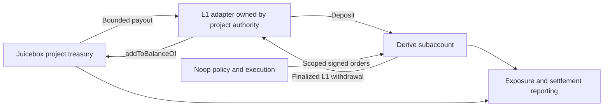

# Derive V3 × Noop × Juicebox V6

Research briefing · 11 September 2026 · Preparation for strategy design

**Working thesis.** Noop can become a treasury-management product built around explicit protection and income policies. Derive supplies execution, margin, lending, and pooled strategy infrastructure. Juicebox can supply project funding, spending rules, ownership, and revenue distribution. The most promising initial composition is a Juicebox treasury allocating a bounded strategy budget to a contract-owned Derive account, operated by Noop.

This is a product hypothesis, not a conclusion about strategy profitability. The study covers public V3 guides and API schemas, Noop implementation, and selected Juicebox V6 contracts. It does not establish production readiness or audit either protocol.

**1. What V3 changes**

Derive describes V3 as a zk application settling batches directly to Ethereum L1, replacing the separate exchange/Derive Chain arrangement. EOAs and multisigs become direct owners; the docs say the V2 migration will automatically move subaccount ownership from intermediate smart-contract wallets. The introduction still labels mainnet “coming soon,” and the contracts guide publishes Sepolia addresses, leaving mainnet addresses to deployment discovery. Published mainnet URLs are not evidence of a completed launch. [Architecture changes](https://docs.derive.xyz/migrating/v3-improvements), [introduction](https://docs.derive.xyz/getting-started/introduction), [contracts](https://docs.derive.xyz/getting-started/contracts).

| Capability | Significance for Noop and Juicebox |
| --- | --- |
| Direct Ethereum contract ownership | A treasury-controlled contract can own a Derive account and delegate operations to Noop. |
| Programmatic onboarding | Customer onboarding can be built into Noop; a credited deposit creates the account/subaccount. |
| Granular session keys | Separate reporting, trading, vault settlement, and treasury withdrawal authority. |
| Native vaults | Package a common strategy for pooled depositors, with native shares and fee accounting. |
| Risk universes | Select collateral, instruments, lending terms, and the relevant loss-sharing boundary together. |
| Lending across collateral assets | Evaluate the combined cost of protection, borrowing, and collateral yield. |
| RFQ packages | Potentially execute collars or option rolls as multi-leg packages. |

These capabilities are documented, with deployment-specific availability still requiring verification. A risk universe limits where insolvency losses are shared; it does not eliminate losses inside that universe. Trades and RFQs cannot cross universe boundaries. [New features](https://docs.derive.xyz/migrating/new-features), [risk universes](https://docs.derive.xyz/trading/managers-and-risk-universes), [RFQ](https://docs.derive.xyz/trading/rfq).

**2. What Noop already contributes**

The current system combines long ETH put selection, opportunistic short calls, protection budgets, execution/reconciliation, market research, and a learning/reporting interface. Its differentiation is the policy and operating history around those activities. The existence of backtesting and learning infrastructure does not itself demonstrate an investable edge.

Implementation anchors:

- [script.js](../script.js): strategy, old API integration, manually encoded action signing, and execution.
- [bot/index.js](../bot/index.js): starts the database and loads the main script.
- [bot/db.js](../bot/db.js): orders, resting orders, budgets, snapshots, candidate observations, lessons, and decision outcomes; bot state uses a singleton row.
- [dashboard/src/lib/lyra.ts](../dashboard/src/lib/lyra.ts): independent authenticated account client, hardcoded wallet/subaccount, caching, and margin-display calculation.
- [PnL report](../dashboard/src/app/api/pnl-report/route.ts): explicitly adds configured off-platform ETH to Derive portfolio value.
- [PRINCIPLES.md](../PRINCIPLES.md): retention and time-resolution rules for long-lived research data.

The external-ETH distinction is central. Noop can manage a hedge for an exposure held elsewhere, but that ETH does not become Derive collateral. It also cannot be included in a pooled vault's NAV unless the vault actually owns the asset. For a customer account, report both the hedge account and the broader protected treasury, with explicit attribution.

The long source-file header is partly historical: its fee description differs from the current `placeOrder` implementation, for example. Future migration work should trace executed functions and tests rather than treating comments as current strategy specifications.

**3. A migration that also prepares the product**

Build one venue adapter used by execution and reporting. Give it explicit environment, owner, signer, subaccount, manager, and risk-universe configuration. Keep strategy decisions separate from request encoding. This creates a natural boundary for supporting multiple customers later.

| Current seam | Migration work |
| --- | --- |
| `api.lyra.finance` and `X-Lyra*` in two clients | V3 host/path and `X-Derive*`; retain the distinction between login and action authorization. |
| Hardcoded account and domain | Discover migrated ownership; recompute the domain for Ethereum/Sepolia; verify every signing constant. |
| `parseInt` nonce constructed from milliseconds | Use the V3 nanosecond format with exact integer handling and string serialization. |
| `public/get_instruments` | Replace with the supported all/live instrument discovery route and normalize its response. |
| Existing subaccount response assumptions | Handle array-valued currency, manager/universe IDs, unavailable portfolios, and vault holds. |
| Transaction-oriented reconciliation | Track operation identity, batch progression, and eventual L1 settlement separately from fills. |
| Historical PnL | Preserve V2 provenance; ingest actual option settlement, interest, fees, and cash movements. |
| Dashboard trade history limited to one page of 100 | Implement complete pagination before relying on it for customer accounting. |

The migration guide specifies these wire changes and notes that `projected_margin_change` currently returns zero. The API still exposes a private option-settlement history route. [Migration guide](https://docs.derive.xyz/migrating/breaking-changes), [OpenAPI](https://docs.derive.xyz/openapi.json).

Prefer a pinned official TypeScript SDK behind the adapter, after inspecting its actual exports and behavior. Use signing-preview helpers to compare encoded payloads and hashes. The nonce must never pass through JavaScript `Number`; the schema models order-request nonces as strings. Login signs a millisecond timestamp, which is a different value from the action nonce. [Action signing](https://docs.derive.xyz/authentication/action-signing), [session login](https://docs.derive.xyz/authentication/session-login).

Suggested migration sequence:

1. Capture representative V2 account, instrument, order, and history fixtures; define a normalized internal model.
2. Build a public-data V3 adapter and compare instrument selection, decimal handling, and risk configuration.
3. Exercise signing and reconciliation with a dedicated testnet account, including partial fills, cancelled orders, restarts, and expired credentials.
4. Validate ETH collateral plus long puts and short calls under the chosen manager, including borrowing and stressed exits. External ETH must contribute zero venue margin.
5. Rehearse the announced state migration: ownership, positions, balances, pending orders, historical identifiers, and session-key treatment. Automatic ownership migration alone does not specify these other outcomes.
6. At the confirmed cutover, reconcile the migrated account and allow only one execution writer. Rollback depends on Derive's actual V2 availability; it cannot be assumed to be a URL toggle.

Do not combine migration with a new strategy or a vault launch. Establish comparable behavior first, then evaluate product changes against that baseline.

**4. Product opportunities, in priority order**

| Product | Customer promise | Business model hypothesis | First proof needed |
| --- | --- | --- | --- |
| Noop Treasury | Set exposure, protection budget, and income policy; receive managed execution and understandable reporting | Subscription or treasury-service fee | Several independently configured treasuries operate reliably and value the reporting |
| Noop vault | Deposit into a shared, clearly specified strategy | Native management/performance fees | Net performance, withdrawal liquidity, curator operations, and strategy capacity |
| Embedded Noop | Other treasury apps offer protection and income controls | Integration/service pricing | A partner can onboard and operate without bespoke support |
| Strategy platform | Curators launch policies with Noop execution, reporting, and funding tools | Platform fees | The operating system generalizes beyond our own strategy |

Start with treasury accounts because they match Noop's existing treatment of externally held ETH and allow different customer mandates. A protection budget is a spending limit, not a guaranteed portfolio floor: strikes, expiry gaps, execution, and collateral/liquidation conditions all affect the outcome. Short-call premium should be evaluated together with foregone upside and loss exposure.

The customer-facing inputs should be economic: exposure to manage, acceptable premium spend, permitted call coverage, liquidity needs, and authority granted to the service. Instrument selection, risk universes, and signing internals belong underneath those controls.

For every account, measure protection cost, stress payoff, net income after losses and financing, execution slippage, margin headroom, and operational reliability. Compare with ETH holding and simple static hedges. Customer willingness to pay and repeat usage are separate evidence from trading performance.

**5. What a native vault entails**

Vaults already supply shares, NAV, curator roles, and a configurable deposit asset. Their creation parameters include the manager, benchmark, fees, cooldown, and share-price tolerance. The guide currently states a $1,000 creation fee. Treat these as current documented terms to reconfirm for launch. [Vault creation](https://docs.derive.xyz/vaults/create-a-vault).

The curator operates a deposit/withdrawal settlement loop. Requests must be polled; there is no dedicated queue WebSocket channel. Deposits remain held in the source subaccount until settlement. Withdrawals require available deposit-asset liquidity, and the docs require processing within 14 days or risk freezing/delisting. The SDK's stated default intent expiry is much shorter, so request lifetime must match the advertised settlement schedule. [Vault settlement](https://docs.derive.xyz/vaults/deposits-withdrawals).

Fees are minted as additional shares, settle during mint/burn operations, and include a protocol share. Fee rates are immutable. An ETH benchmark can avoid charging performance fees merely for ETH appreciation. The documented curator stake floor is the greater of $10,000 and 1% of vault value; a single management-fee settlement is capped at 2.5% of NAV. This affects seed capital and fee realization. [Vault fees](https://docs.derive.xyz/vaults/fees).

A pooled Noop product therefore needs its own investment mandate, cash-flow-adjusted track record, liquidity reserve, redemption policy, and operator continuity plan. A hedge-only pool and a pool owning ETH plus hedges are different products. Decide which one we intend before reusing Noop's current accounting or marketing performance.

**6. Juicebox's most useful contribution**

The inspected V6 core owns project balances, issuance, rulesets, payout limits, allowances, and cash-outs. Its split-hook interface can route a configured payout into custom logic. This makes treasury funding and revenue distribution a concrete integration point.

| Existing primitive | Proposed Derive composition | Boundary to preserve |
| --- | --- | --- |
| Rulesets and payout limits | Recurring, bounded funding for a Noop mandate | A limit on transfers into a strategy does not limit losses once capital is deployed |
| `IJBSplitHook` | Stage a payout for an L1 contract-owned Derive account | Validate caller/project/token and correctly handle native pushes versus ERC-20 pulls |
| Project ownership and permissions | Control the adapter and authorized operators | Bind control to the intended project authority and define ownership-transfer behavior |
| `addToBalanceOf` | Return withdrawn assets to the originating treasury | Credit only assets actually received; avoid unintended token issuance |
| Project splits | Distribute realized service revenue among builders, operators, or projects | Curator fees first arrive as Derive shares; cash distribution requires redemption and withdrawal |
| Revnet economics | Fund a curator business or a network of strategy operators | Project tokens and strategy-depositor claims have distinct economics |
| Suckers | Coordinate Juicebox project funding across supported chains | They are project-claim infrastructure, not an automatic bridge for Derive positions or vault shares |

Local evidence: [workspace architecture](/Users/jango/Documents/jb/v6/evm/ARCHITECTURE.md), [JBMultiTerminal](/Users/jango/Documents/jb/v6/evm/nana-core-v6/src/JBMultiTerminal.sol), [split-hook interface](/Users/jango/Documents/jb/v6/evm/nana-core-v6/src/interfaces/IJBSplitHook.sol), [existing swap split hook](/Users/jango/Documents/jb/v6/evm/nana-swap-split-hook-v6/src/JBSwapSplitHook.sol), [Revnet overview](/Users/jango/Documents/jb/v6/evm/revnet-core-v6/README.md), [Suckers overview](/Users/jango/Documents/jb/v6/evm/nana-suckers-v6/README.md). These establish local implementation surfaces, not deployed addresses or audited integration readiness.

**Proposed first composition:** a Juicebox project earmarks a strategy budget, a dedicated L1 adapter owns its Derive account, and Noop receives a narrowly scoped trading key. A separate treasury operator controls withdrawals back to the adapter. The adapter restores received assets to the same project's terminal.

Derive documents precisely the necessary contract-ownership pattern: create the account, then have the owning contract submit an L1 session-key authorization. An unrelated EOA cannot stand in for that contract's `msg.sender`. A scoped withdrawal key needs the destination whitelisted, even when withdrawing to the owner. [Contract-owned accounts](https://docs.derive.xyz/authentication/contract-owned-accounts), [transfers and withdrawals](https://docs.derive.xyz/trading/transfers-withdrawals).

The adapter needs an asynchronous lifecycle: funded, deposit submitted, credit observed, active, withdrawal requested, L1 funds received, treasury credited. Operation IDs and balance deltas should make retries safe. A transaction receipt for the deposit is not proof that the intended trading subaccount has been credited; unsupported deposits may route to a fallback subaccount. [Onboarding](https://docs.derive.xyz/getting-started/depositing).

**The accounting constraint:** once a payout leaves Juicebox, ordinary terminal accounting no longer holds that asset. Reporting may show the external strategy position separately, but cash-out promises must reflect locally available assets. The V6 data hook can supply an effective surplus value while the terminal caps reclaim at local liquidity; this is a valuation extension point, not an implemented Derive adapter. [Data-hook interface](/Users/jango/Documents/jb/v6/evm/nana-core-v6/src/interfaces/IJBRulesetDataHook.sol).

If we later want project tokens backed by deployed strategy NAV, we must design authoritative valuation, loss recognition, issuance fairness, and queued redemption together. Simply inserting Derive's API NAV into cash-out calculations would introduce stale-price and unequal-exit risks. The initial bounded treasury allocation avoids needing to invent that entire product immediately.

Also model the actual fee path: local `JBMultiTerminal` documents a 2.5% protocol fee on relevant non-exempt outflows. Add Derive trading, borrowing, withdrawal, and any vault fees plus L1 transaction costs. Frequent small transfers may be uneconomic. Determine exemptions and rounding from the configured deployment rather than assuming them.

**7. How this could expand Derive's offerings**

Three increasingly ambitious hypotheses:

1. **Bring productive treasuries onto Derive.** Juicebox-funded projects become users of protection, calls, and lending through a familiar budget interface. This adds distribution and recurring demand without requiring new Derive assets.
2. **Fund strategy businesses around Derive.** A Juicebox project or Revnet funds development and curator seed capital; realized service/curator revenue returns under explicit distribution rules. Keep depositor principal and business funding in separate accounts and claims. The exact Revnet configuration must support the intended allocations; its post-launch permissions are deliberately constrained.
3. **Help bootstrap new risk universes.** Project communities might fund market-making or security capital around future listings. V3's universe model provides an architectural opening, but it does not establish permissionless universe creation or automatic listing of Juicebox tokens. This requires Derive collaboration, oracle design, liquidity, and risk-policy work.

The first two are app-layer opportunities. The third could reach Derive's core market offering. A treasury-backed token is not automatically suitable collateral: redemption liquidity, manipulation resistance, and correlations with the trading venue would all need evidence.

Avoid beginning with a new stablecoin, vault-share wrapper, or lending against strategy-backed project tokens. Those proposals add valuation and liquidity dependencies before demonstrating demand for the simpler treasury product. No ERC-20/ERC-4626 portability of V3 vault shares was established by the reviewed material.

**8. Findings that require verification**

| Finding | Planning consequence |
| --- | --- |
| Mainnet remains “coming soon”; detailed state cutover is not specified | Obtain launch, migration, and operational continuity details before moving production execution |
| Migration guide gives 90-day order / 30-day vault nonce windows; signing guide gives 120 / 60 days | Pin and test the exact SDK/server rules; avoid depending on maximum windows |
| Migration guide describes off-chain key retirement; contract-owned-account guide says revocation requires L1 | Treat revocation and effective timing as a specific acceptance test |
| Margin simulation appears in OpenAPI but is also listed as coming soon | Endpoint documentation is not proof of functioning risk simulation |
| `projected_margin_change` is documented as zero | Never interpret it as evidence that an order consumes no margin |
| Testnet collateral fields differ substantially between SM and PM2 | Validate manager-specific semantics before reusing Noop's margin calculations |

Sources: [migration](https://docs.derive.xyz/migrating/breaking-changes), [signing](https://docs.derive.xyz/authentication/action-signing), [contract ownership](https://docs.derive.xyz/authentication/contract-owned-accounts), [coming soon](https://docs.derive.xyz/migrating/coming-soon), [OpenAPI](https://docs.derive.xyz/openapi.json).

A credential-free public testnet request to `public/get_risk_universes` succeeded on the study date. Universe 1 exposed ETH options under manager 1 (`SM`) and manager 5 (`PM2`), with ETH and USDC collateral entries. For SM, ETH's reported `im_discount`/`mm_discount` were `0.75`/`0.8`; PM2 reported `0.07`/`0.06`, and USDC `0`/`0`. These are observations, not an interpretation of portfolio-margin economics or production settings. They illustrate why the generic discount explanation needs checking against the actual PM2 calculation.

Questions for a future Derive discussion: exact migration treatment of outstanding orders and keys; margin simulation readiness and PM2 semantics; lending liquidity and withdrawal behavior under stress; supported vault-share ownership/transfer paths; batching and escape-hatch timing; builder economics; and the process for proposing universes, collateral, and security capital. No outreach was performed.

**9. Suggested next strategy session**

Decide the first customer and mandate: an ETH treasury buying protection, a treasury seeking premium income, or a pooled depositor. Then compare account-per-customer and vault delivery using real operational and fee assumptions. My current preference is a treasury account product first, followed by a deliberately separate pooled strategy if the evidence supports it.

The smallest useful prototype is one Juicebox test project, one contract-owned Derive testnet account, a scoped Noop execution key, and a complete funding/withdrawal/return reconciliation. Its success criterion is correct authority, accounting, and recovery across the full lifecycle. Profitability and customer demand need separate experiments.

Provenance: Noop HEAD `8dc0bf9ec4f4049c1458880c5d264f4ca4a1383c`; local nana-core-v6 HEAD `898f08b96194391d545df31a62f9d89ef6759f9a`. Local working files were the inspection source. Public documentation is mutable; recheck it at implementation. This study made no trading, deployment, credential, or production configuration changes.
