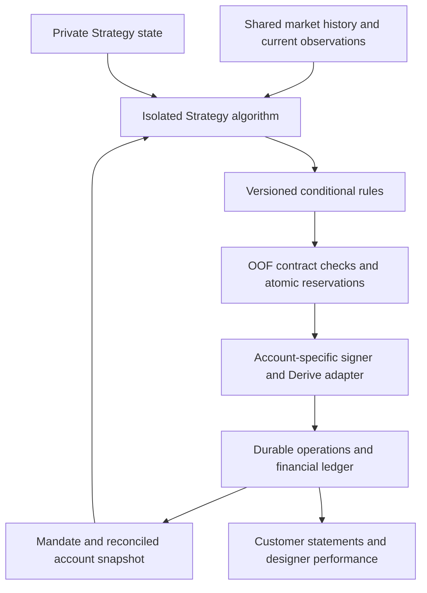

# OOF — operating specification

Status: product decisions and proposed implementation contract, 11 September 2026. This document specifies the next product; it does not change the running V2 operation or enable customer execution. The Strategy contract, capital accounting, and implementation plan are linked below.

## Product

OOF is the new Derive V3 platform for multiple independently designed Strategies. **Noop** (NO OPERATION) remains the name of the existing operation and its ETH protection and accumulation Strategy; Noop can be one of many Strategies on OOF. OOF supplies the shared data, mandate, execution, accounting, and customer-control infrastructure.

The initial product scope remains ETH risk mitigation and net ETH accumulation through disciplined protection purchases, call selling, protection monetization, and ETH conversion. This naming decision, recorded 14 September 2026, does not change the accepted funding requirement, supported assets or actions, account model, economic decisions, or implementation status.

There are two users:

1. **Customers** allocate capital to a selected Strategy to manage risk associated with a declared ETH exposure.
2. **Strategy designers** publish algorithms that turn market observations and history into conditional executable instructions, and can receive an agreed share of measured performance.

The customer-facing program supports time-budgeted put purchases, short-call operation, sales of owned puts, call buybacks, and spot ETH purchases/sales. A Strategy chooses their timing, valuation methods, thresholds, sizing policy, and interactions within its accepted mandate.

## Confirmed decisions and proposed choices

| Item | Status | Meaning |
| --- | --- | --- |
| OOF platform; Noop Strategy | Confirmed | The current operation remains Noop. OOF hosts multiple Strategy offerings, including Noop. |
| ETH protection and net ETH accumulation | Confirmed | Judge the program by both protection delivered and net wealth in ETH, including outstanding liabilities. |
| 10% activation funding | Confirmed | To activate protection for 20 ETH, the customer contributes 2 ETH of operating capital. It is capital, not an activation fee. |
| Exit initiation at any time | Confirmed | A customer can instruct OOF to close positions or unwind the account without waiting for the Strategy's normal exit signals. Actual proceeds follow execution and settlement. |
| Arbitrary Strategy algorithms | Confirmed | Designers can use different models, algorithms, data, and private state. Their programs output instructions; they do not own execution authority. |
| Shared OOF market history and private Strategy history | Confirmed | Both are supported, with explicit provenance and permissions. |
| 25-DTE put roll, 80% call-profit capture, 45% margin target | **Strategy-specific** | These are possible settings of one Strategy. OOF does not insert, enforce universally, or silently restore them. |
| Designer performance participation | Confirmed objective; formula proposed | The calculation, rates, timing, and recipient split require published terms before any charge. |
| One customer mandate per Derive subaccount | Proposed initial architecture | Isolates customer books and makes exits, attribution, and strategy changes tractable. |
| One active Strategy release per mandate | Proposed initial architecture | A customer may hold several separately funded mandates. Do not combine uncoordinated Strategies in one account. |
| Ongoing 10% maintenance ratio | Undecided | The activation requirement does not imply automatic top-ups or automatic liquidation after losses. |

For the 20/2 example, this specification interprets the declared 20 ETH as including the 2 ETH contributed, leaving 18 ETH externally held. External holdings remain a reference exposure; OOF does not gain authority over them. A later change in declared exposure is an explicit mandate revision.

## Authority and policy boundaries

| Owner | Responsibilities |
| --- | --- |
| Customer | Select the Strategy release and accepted parameters, fund the account, approve changes to authority or economic terms, initiate closure/withdrawal, retain ownership authority. |
| Strategy designer | Define opportunity scoring, spending policy, roll/monetization logic, call-entry/capture/risk logic, ETH conversion timing, expected data, and failure behavior. Publish versions and explain their economic constraints. |
| OOF | Enforce the accepted contract; isolate accounts, algorithms, and credentials; preserve correct accounting and reservations; reconcile uncertain operations; implement customer exits; report outcomes and fees. |
| Derive | Apply venue permissions, margin requirements, matching, account operation, and settlement under the configured deployment and manager. |

OOF's universal checks are identity, authorization, data/operation validity, account isolation, finite executable bounds, available funds and closeable quantities, conformance to the accepted Strategy policy, and venue requirements. An owned-put exit must not become an opening short-put trade; an existing short-call close must not become an unintended long call.

Economic settings belong to the Strategy and its customer-accepted configuration: premium rate and basis, budget window/accrual, carry-forward, DTE/delta ranges, roll conditions, retained-protection policy, monetization tranches, call-profit thresholds, utilization target/overrides, stress limits, borrowing limits, and conversion timing. OOF computes and enforces those settings without inventing their values.

The Strategy's internal algorithm can change its recommendation with market conditions. It cannot use an output message to expand its accepted spending limit, authorize a new recipient, replace its own release, or change its fee terms. Dynamic risk limits must be part of the disclosed, versioned policy, with explicit bounds and reproducible inputs.

Mechanical normalization may round to valid venue increments without making price, quantity, or economic bounds worse for the customer. If that cannot produce a valid order, reject the instruction with a reason; do not repair its economic policy. This extends the distinction in the earlier [V2 rule-normalization plan](plans/2026-06-02-advisor-rule-normalization-removal-plan.md), whose numerical thresholds remain specific to that historical Strategy.

### Market movement and emergencies

A Strategy margin target must identify its metric, numerator/denominator, manager, treatment of live orders, and whether it limits new entries or specifies an ongoing target. A market-driven breach is a state to evaluate, not proof that the executor submitted an invalid order. The Strategy defines its response within the accepted mandate.

OOF may stop new submissions on stale data, missing accounting, expired authority, or unavailable venue services. Automatic risk-reduction trades require an explicit, customer-accepted emergency policy with bounded actions and evidence. OOF does not reinterpret "never panic buying" as either an obligation to ignore insolvency or permission to close at any price. Customer-requested closure takes priority over ordinary Strategy profit targets.

A full customer unwind uses a separately accepted exit policy. Ordinary Strategy entry targets, premium budgets, retained-protection requirements, replacement dependencies, roll timing, and profit thresholds cannot veto that unwind. Exit actions retain identity, authorization, execution-price bounds, available-resource, accounting, and venue solvency checks; the exit plan sequences actions to satisfy them. OOF cannot promise an immediately executable close when those checks fail.

All prospective trades require portfolio-aware checks. Closing a put can remove protection or a margin offset; buying back a call consumes cash. A venue's `reduce_only` flag does not settle those portfolio questions.

## Domain objects

| Object | Required identity and contents |
| --- | --- |
| Customer | Customer ID, ownership proof, permitted recipients, account access policy. |
| Strategy release | Immutable `strategy_release_id`, `release_digest`, `noop.strategy/v1` contract version, runtime requirements, declared capabilities, configurable policy bounds, fee proposal, data requirements. |
| Mandate | Customer/mandate IDs, `mandate_revision`, protected ETH reference, activation terms, selected Strategy release/digest, accepted parameters, authority, fee-policy reference, venue/network/owner/subaccount/manager/universe. |
| Decision | `decision_id`, exact mandate revision and Strategy release, `input_bundle_id`, private-state revision, evaluation timestamps, output and reasons. |
| Conditional intent | Stable `intent_id` and revision, typed action, finite conditions/validity, exact sizing and price bounds, dependencies, retry/trigger-consumption policy. |
| Operation | Approved intent revision, account identity, nonce, order/quote/operation IDs, durable observations of acceptance, fills, accounting, and settlement. |
| Capital ledger | Customer flows, assets, option liabilities, debts, interest, fees, reserves, cost basis, reconciled venue events, ETH-valued statements. |
| Performance record | Valuation method/version, flows and costs, Strategy allocation epoch, net ETH performance, protection outcomes, fee basis and crystallization records. |

`noop.strategy/v1` remains the v1 wire-contract identifier for compatibility with existing releases and recorded decisions; it is not the OOF platform name.

Use exact decimal strings or fixed-point integers for financial values; keep asset, unit, and valuation timestamps explicit. A quantity such as `20` is invalid without its asset and role. External ETH never enters account NAV, margin, feeable assets, or withdrawable cash.

## Strategy operation

The proposed contract is specified in [Strategy input/output and runtime](oof-strategy-contract.md).

The initial action vocabulary is `buy_put`, `sell_call`, `sell_put`, `buyback_call`, `buy_spot_eth`, and `sell_spot_eth`. Position exits include a purpose, such as rolling protection, monetizing a hedge, capturing call profit, or reducing specified risk. These purposes do not imply hardcoded DTE or profit numbers. Customer closure is a separately authorized service operation.

Several individually valid rules must not collectively spend the same premium budget, reserve the same margin, close the same contracts, or consume cash earmarked for settlement or withdrawal. Reservations and cumulative consumption belong to OOF, survive restarts, and are released only on verified evidence.

Triggering a rule does not establish that an order filled. Dependent actions consume confirmed resource changes. If a put sale funds an ETH purchase, an acknowledgement alone does not make its proposed proceeds available. A request for replacement protection must reach the required filled quantity before a dependent sale can rely on that protection; a quote or open order is insufficient.

Strategy releases can use any algorithm internally. Runs have bounded compute, isolated storage, explicit network permissions, and no trading/withdrawal credentials. External data or non-deterministic model outputs used for an actual decision are retained as artifacts; deterministic execution of the recorded output is required even when reproducing the original model call is not possible.

## Data and evidence

Maintain three stores with separate access rules:

1. **Shared observations:** venue instruments, executable quotes/depth, trades, funding/lending information, prices, and available market history.
2. **Customer financial state:** capital flows, liabilities, positions, orders, budgets, reserves, authority, performance, and exits.
3. **Private Strategy state:** designer-specific features, models, research, and customer-scoped memory where needed. A shared designer model does not grant access to other customers' private account state.

Each observation records event time, first-observed/available time, source, revision, schema, and quality. As-of queries exclude information not available at the decision time. Late corrections append a revision rather than replacing the evidence supporting past decisions. Derived features carry an algorithm version and source references; changing a score must not silently rewrite history.

Preserve raw observations and provide explicit resolution tiers as required by [PRINCIPLES.md](../PRINCIPLES.md). Display rollups and exact decision/replay inputs are distinct query modes. Report data gaps and missing executable depth rather than filling them with optimistic simulated liquidity. Existing V2 option snapshots focus on selected candidates and do not establish a complete historical options chain.

## Customer capital and exits

The complete proposed lifecycle and accounting are in [Capital and performance](oof-capital-and-performance.md).

- Activation requires confirmed, correctly credited ETH funding for the declared 10% requirement and a supported account/manager. A sent L1 transaction or an uncredited deposit is not activation evidence.
- Operating capital remains separate from external reference exposure. Strategies consume a versioned time-based budget, not a balance they can rewrite.
- ETH acquisition is measured net of financing and liabilities. Buying ETH with newly borrowed funds does not itself create performance.
- A customer can request closure while the Strategy would prefer to hold. New-risk work is invalidated immediately; live orders, partial fills, debt, and withdrawal capacity are reconciled before funds are returned.
- The interface distinguishes estimated NAV, executable unwind estimates, held/reserved assets, and confirmed withdrawable funds. No fixed lock period or guaranteed immediate mark-price redemption is implied.
- Full unwind is required for the initial product. Partial exits are a proposed extension and require portfolio and mandate revalidation. Reducing the declared exposure or changing Strategy cannot erase existing obligations or the loss carry-forward under the proposed fee policy.

## Customer and designer interfaces

Customers need an exposure/funding preview, a readable Strategy policy, expected cost/scenario information, current protection and account statements, activity explanations, and closure/withdrawal controls. Present 25 DTE, 80%, or 45% only when those are actual settings of the selected Strategy.

Designers need the data contract, local/replay runner, private state storage, conditional-rule validation, version publishing, execution feedback, capacity/performance evidence, and revenue statements. A release can be tested and published without being approved for customer capital. Unverified historical performance and live execution evidence remain distinguishable.

Proposed customer API resources are `/strategies`, `/strategy-releases`, `/mandates`, `/funding`, `/activity`, `/statements`, `/exits`, and `/withdrawals`. Designer resources include `/history`, `/snapshots`, `/decisions`, `/intent-results`, and scoped `/strategy-state`. These are product resources, not a new public raw-signing API. Mutating requests require authenticated authority and durable idempotency identifiers.

Designer compensation is a disclosed performance participation, not a hidden execution spread. [The proposed fee specification](oof-capital-and-performance.md) includes open liabilities, financing, customer flows, and loss recovery. Rates, crystallization frequency, and OOF/designer allocation are not selected here. No fee implementation should activate without explicit agreed terms.

## Juicebox composition

Juicebox can fund Strategy development and operations, collect service revenue, distribute earned designer/OOF fees, and serve as a customer treasury. A small adapter can stage a project-approved allocation for its Derive account and credit actual returned assets to the originating treasury.

Customer collateral, project treasury accounting, and designer business funding are separate claims. Strategy publication or a Juicebox project token must not create an automatic claim on customer collateral. OOF must establish earned, withdrawable fee revenue before it is routed through a JB split. Ordinary JB payment and cash-out paths must not synchronously depend on a Derive API call.

The initial product does not require new pooled shares, an OOF token, or a Derive vault wrapper. A later pooled delivery model needs its own valuation, redemption, and depositor-rights contract.

## Open product decisions

These are concrete choices left open, not reasons to delay the specification or read-only foundations:

| Decision | Required before |
| --- | --- |
| Treatment of later funding, increased protected exposure, and a declining operating-capital ratio | Customer funding/partial withdrawal implementation |
| Default reference Strategy's exact policy, including whether to retain the existing breakout override | Publishing a customer-selectable reference release |
| Designer fee rate, OOF share, crystallization schedule, and continuing-loss treatment across designer changes | Any fee-bearing pilot |
| Account owner form, supported manager, and scoped custody/withdrawal delegation | Customer onboarding |
| Customer liability terms consistent with venue rules; liquidation, bad-debt, and residual-asset resolution | Customer onboarding |
| Named emergency/exit policy, escalation, liquidity bounds, and degraded-mode operations | Automated live customer execution |
| Protection claims and performance metrics presented to customers | Public Strategy listing |

## Delivery and references

Follow [the implementation plan](plans/oof-v3-productization.md). The first code milestone is a V2-reference Strategy extraction plus an alternative-policy fixture, with no change to existing production semantics. The [V3 audit](derive-v3-audit-2026-09-11.md) remains the list of lifecycle evidence needed before customer funds.

Primary capability references: [Derive session keys](https://docs.derive.xyz/authentication/session-keys), [contract-owned accounts](https://docs.derive.xyz/authentication/contract-owned-accounts), [managers and risk universes](https://docs.derive.xyz/trading/managers-and-risk-universes), [transfers and withdrawals](https://docs.derive.xyz/trading/transfers-withdrawals). These describe venue capabilities; the OOF product choices above are proposals or explicitly confirmed decisions, not features already implemented by Derive or OOF.
